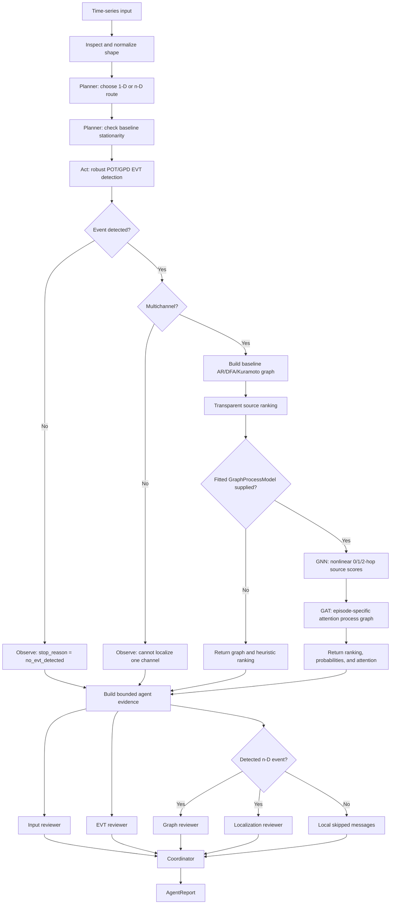

# Agent and numerical pipeline

This note distinguishes the deterministic signal-processing pipeline from the
optional LLM review team. In particular, this repository does **not** implement
a GNN or GAT.

## End-to-end data flow

`GraphEVTPipeline.run_detailed` runs these stages in order:

1. **Load and inspect.** A CSV/EDF path is loaded, then `InputInspector`
   validates the time axis, channel names, missing-value policy, and converts
   the input to a finite `[time, channel]` array.
2. **Detect an extreme episode.** The baseline median and MAD are used for
   robust channel-wise standardization. At every time point, the mean of the
   largest `top_k` absolute z-scores becomes a scalar anomaly indicator. A
   peaks-over-threshold generalized Pareto (POT/GPD) model fitted only to the
   baseline sets the alarm threshold. The detector returns the first
   post-baseline run of `persistence` consecutive exceedances.
3. **Stop when localization is not identifiable.** If no event was detected,
   or the input has only one channel, the graph and source ranking are `None`.
4. **Build a frozen baseline graph.** For a detected multichannel event, the
   selected graph method uses only samples before `baseline_size`; event data
   therefore cannot create an edge.
5. **Rank candidate sources.** A fixed, transparent formula combines each
   channel's post-alarm peak, energy, latency, graph degree, and neighboring
   peak. A softmax turns these scores into heuristic relative weights. They are
   not calibrated causal probabilities.

The default graph method is `auto`. It uses an AR-innovation graph when a
simple four-block location/variance heuristic calls the baseline approximately
stationary. Otherwise it uses the intersection of DFA and Kuramoto edges.
For a scientific experiment, choose and freeze `ar`, `dfa`, `kuramoto`, or
`ensemble` on training/validation data instead of selecting from test results.

## What the graph represents

The graph is a **baseline association hypothesis between observed channels**.
Node `i` is input column `i`; channel names remain available separately in the
input profile. `GraphResult` contains:

- `adjacency`: a symmetric boolean `[channel, channel]` matrix used by the
  localizer;
- `dependence`: the method-specific, continuous pairwise score matrix;
- `method`: the method that actually ran (important when `auto` was requested);
- `diagnostics`: method-specific values needed to inspect the result.

Every node has a diagonal self-loop. Off-diagonal entries are undirected: an
edge `i—j` says that the two baseline signals meet the configured association
rule. It does **not** say that `i` causes `j`, that a signal travelled in either
direction, or that either node is the event source. Directed graphs are not
supported; configuration now rejects `directed=True` rather than silently
returning an undirected graph.

The available graph builders are:

| Configuration | Pairwise evidence | Edge rule |
| --- | --- | --- |
| `ar` | Absolute correlation between residuals from separate, channel-wise AR models | Dependence is at least `edge_threshold` |
| `dfa` | Equal-weight average of detrended cross-scale correlation and DFA-exponent similarity | Dependence is at least `edge_threshold` |
| `kuramoto` | Wavelet-phase locking value (PLV) | PLV exceeds both `edge_threshold` and its pairwise surrogate quantile |
| `ensemble` | DFA and Kuramoto results | Edge must be accepted by **both** methods; reported dependence is their geometric mean |
| `auto` | AR for a baseline passing the stationarity heuristic, otherwise `ensemble` | Rule of the selected method |

Only `data[:baseline_size]` enters graph construction. “Frozen” here means
that post-baseline/event samples cannot influence the graph in one pipeline
run; it does not mean a serialized graph is reused automatically across
episodes. The caller must keep the configuration fixed and arrange any
cross-episode training/test protocol.

The graph affects localization in two places. Its row sum supplies node degree,
and its adjacency-weighted neighborhood supplies the mean neighboring peak.
Degree is retained in the returned feature matrix for inspection, while the
current hand-written score directly uses the neighboring peak but not degree.
Therefore the graph can adjust a ranking, but it is not itself a GNN and it is
not trained from source labels.

### Reading a graph result

```python
run = pipeline.run_detailed(source)
if run.graph is not None:
    print(run.graph.method)
    print(run.input_profile.channel_names)
    print(run.graph.adjacency.astype(int))
    print(run.graph.dependence)
    print(run.graph.diagnostics)
```

`graph is None` is expected for a univariate input or when EVT did not detect an
episode. To study the baseline graph independently of event detection, call
`graph_evt_agent.graph.build_graph(baseline, graph_config)` directly.

## What the “agents” do

`EVTAgentTeam` first executes the complete deterministic pipeline. It then
sends a bounded JSON summary—not the raw time series—to Mistral reviewers in a
fixed sequence:

1. input-data reviewer;
2. EVT-detection reviewer;
3. graph reviewer (multichannel detected events only);
4. localization reviewer (multichannel detected events only);
5. coordinator, which receives the numerical summary and the preceding
   reviews.

Thus the LLM is an explanation/audit layer. It does not choose the EVT
threshold, edit graph edges, train a model, or change the ranking. A detected
multichannel run makes five API calls; a univariate or non-detected run makes
three because graph and localization review are skipped.

### Orchestration model

The numerical orchestrator is a deterministic plan/act/observe state machine.
`PipelinePlanner` inspects dimensionality and baseline stationarity, declares
the eligible actions, and records what actually completed. It always tests for
an EVT event: stationarity helps select a graph method but does not prove that
extremes cannot occur. After observing detection, it stops with
`no_evt_detected`, stops localization with `single_channel_cannot_localize`, or
continues through graph, ranking, and optional learned process inference.

The LLM orchestrator remains the synchronous `EVTAgentTeam.run` method. Its
specialists are prompt roles through one injected `ChatClient`, not operating
system processes. They have no tool loop or shared memory and cannot change the
numerical plan.



Calls are serial and deterministic in order, although the text returned by the
provider is not guaranteed to be deterministic. The input, EVT, graph, and
localization reviewers do not see one another's prose, so their reviews are
independent conditional on the numerical evidence. Only the coordinator sees
all four reviews. This is a fan-out/fan-in review pattern implemented
sequentially, not a debate or a voting system.

### Evidence passed to each role

The numerical pipeline result is converted into JSON-safe Python values first.
To keep prompts bounded, the agent evidence deliberately contains only:

- the complete input profile;
- detection status, event index, alarm threshold, indicator min/max/length;
- graph method, node/edge counts, and dependence min/max;
- at most the first ten ranked node IDs and their weights;
- the execution trace and, when present, GNN/GAT source probabilities plus the
  ten strongest learned attention edges.

The input reviewer receives only the input profile. The other specialist roles
receive the bounded evidence object. The coordinator receives that same
evidence plus every specialist review. Raw samples, the full anomaly-indicator
series, adjacency/dependence matrices, graph diagnostics, localization feature
matrix, and ranks after the first ten are **not** sent to the LLM. They remain
available in `AgentReport.result` for programmatic inspection.

Each role receives a guard instruction to use only the JSON, preserve numeric
results, distinguish statistical rarity from causality, and state limitations.
This is prompt-level control, not a formal proof or output schema: reviewer and
coordinator outputs are accepted as plain strings.

### Routing and failure behavior

The conditional route is based on deterministic results, never on an LLM
decision:

| Pipeline result | Specialist API calls | Coordinator | Total |
| --- | ---: | ---: | ---: |
| Detected multichannel event | input + EVT + graph + localization | 1 | 5 |
| Univariate input | input + EVT | 1 | 3 |
| No detected event | input + EVT | 1 | 3 |

For skipped paths, the orchestrator creates explicit local Russian-language
messages explaining whether the reason was a univariate input or no detection.
Those messages are included in the coordinator prompt.

`MistralClient` validates that a key exists, uses low temperature, and retries
rate-limit, connection, and server failures with short exponential backoff.
Authentication/authorization and other non-retryable client errors fail fast
with sanitized exceptions. There is no partial `AgentReport`: if any required
LLM call ultimately fails, `EVTAgentTeam.run` raises even though deterministic
calculation occurred earlier. Applications that must retain numerical output
during provider outages should call `pipeline.run_detailed` separately and
treat the LLM review as optional.

### Extension points and limits

Any provider can be used by injecting an object with
`complete(system: str, user: str) -> str`; tests use a fake client and require
no network. Adding a real parallel fan-out could reduce latency for the graph
and localization reviews, but would need explicit retry, ordering, and rate
limit handling. Adding structured outputs would make reviews machine-checkable.
Neither change alters numerical performance because the agents remain
downstream auditors.

This architecture should therefore be described as a **role-based LLM review
pipeline**, not a self-directed multi-agent system. Its benefit is separated,
readable critique of a reproducible numerical result; its limitation is that
the critiques are unverified natural language and do not create new numerical
evidence.

## DFA: implemented and tested

`method="dfa"` implements a multiscale DFA/cross-DFA-style graph:

1. center each baseline channel and integrate it into a profile;
2. split each profile into non-overlapping windows at every configured scale;
3. remove a least-squares linear trend within every window;
4. calculate the RMS fluctuation at every scale and estimate each channel's
   DFA exponent from the slope of `log(F)` against `log(scale)`;
5. calculate absolute correlations between flattened detrended profiles;
6. average cross-scale correlation with similarity between DFA exponents, then
   threshold the result into an undirected adjacency matrix.

The implementation is runnable and the test suite verifies that two channels
with a shared stochastic trend receive greater dependence than an unrelated
channel. The output includes scales, fluctuation curves, and exponents for
inspection. “Works” here means the code executes and passes that synthetic
behavioral test—not that the inferred edges have been scientifically validated
for an unseen dataset. Scale selection, non-overlapping-window choices, and the
ad hoc 50/50 similarity combination must be validated for the application.

## Wavelet–Kuramoto: implemented and tested

`method="kuramoto"` performs these steps on the baseline:

1. convolve every channel with complex Morlet kernels at configured periods;
2. extract instantaneous wavelet phases;
3. use the magnitude of the mean pairwise phase difference vector as the
   phase-locking value (PLV), averaged over time and periods;
4. independently circular-shift channel phases to produce a reproducible null
   distribution;
5. retain an edge only when its PLV exceeds both `edge_threshold` and the
   configured surrogate quantile;
6. report the mean Kuramoto order parameter per period as a diagnostic.

The test suite confirms that the method recovers a synthetic phase-locked pair,
rejects its pairing with noise, and is reproducible for a fixed random seed.
This is evidence of implementation behavior, not evidence of physical coupling
or directionality. Common drivers, edge effects, period choice, and multiple
testing can still produce misleading edges.

## Learned GNN and GAT process model

`GraphProcessModel` is an optional supervised stage. It trains two compact
NumPy models from labelled `GraphEpisode` objects and has no heavyweight
deep-learning dependency:

- the **GNN** concatenates each node's standardized features with normalized
  one-hop and two-hop graph aggregates, then learns a nonlinear hidden layer
  and node logits;
- the **GAT** learns source/target attention vectors, masks attention to accepted
  graph edges, produces episode-specific neighbor weights, and learns nonlinear
  node logits from self and attended-neighbor features;
- both use node-level cross-entropy, L2 regularization, Adam optimization, and a
  softmax across candidate nodes.

The returned `GraphProcessPrediction` contains GNN and GAT probabilities in
original node order. Its row-normalized `attention` matrix is the learned graph
model of the observed episode: entry `[i, j]` is how strongly node `i` uses
neighbor `j` for inference. This matrix is directed even though the baseline
candidate adjacency is undirected. Attention is a predictive weight—not proof
of physical direction or causality.

Training requires independent episodes with a known source node:

```python
from graph_evt_agent import (
    GraphEpisode, GraphLearningConfig, GraphProcessModel,
)

episodes = [
    GraphEpisode(
        features=run.ranking.features,  # [node, five current features]
        adjacency=run.graph.adjacency,
        source=known_source_node,
    )
    for run, known_source_node in labelled_training_runs
]
model = GraphProcessModel(
    GraphLearningConfig(hidden_dim=8, epochs=300, random_state=42)
).fit(episodes)

pipeline = GraphEVTPipeline(evt_config, graph_config, process_model=model)
result = pipeline.run_detailed(new_timeseries)
print(result.process.gnn_source, result.process.gat_source)
print(result.process.attention)  # episode-specific weighted process graph
```

The feature schema must match training, and the model refuses inference before
`fit`. A single unlabelled time series can provide event features and a graph,
but cannot teach supervised source localization by itself. The implementation
does not invent pseudo-labels. A GAN (Generative Adversarial Network) is also
not implemented; GAT here means Graph Attention Network and is the appropriate
component for neighbor weighting.

## What performance a GNN or GAT could add

A graph model would replace only the **source-ranking stage** unless the project
is deliberately redesigned as an end-to-end detector. With the current stage
boundary, EVT alarm threshold, false-alarm rate, and detection delay would not
improve: the neural model would run after EVT has already selected an event.
The potential improvement is better Top-1/Top-k source localization and better
ranking/calibration among channels.

The current scorer applies the same fixed formula to every episode. A GNN could
learn nonlinear combinations of `[peak, energy, latency, degree,
neighbor_peak]` and propagate information across multiple graph hops. A GAT
could additionally learn that some neighbors are more useful than others for a
particular episode. This can help when labelled episodes exhibit a repeatable
propagation pattern that is aligned with the baseline graph. It is unlikely to
help—and can be worse—when labels are scarce, the association graph is noisy,
different subjects have different channel layouts, or the true source is not
observed.

No defensible percentage gain can be inferred from the present repository. Its
tests contain synthetic behavior checks, not a corpus of independent episodes
with source labels. Reporting an expected accuracy number before constructing
that dataset would be speculation. Measure the gain with a held-out,
subject-level evaluation instead.

### Implemented first model and possible extension

The implemented model follows the small node-classification starting point:

1. Treat one detected episode as one graph and its known source channel as the
   node-class label.
2. Use robustly standardized per-node event features. Begin with the current
   five features, but correct latency for sampling rate and consider adding
   signed peak, onset slope, time-to-peak, and several short-window energy bins.
3. Use the Boolean adjacency as `edge_index`; test continuous dependence as an
   edge feature/weight separately. Do not expose post-event samples when
   constructing the baseline graph.
4. Learn a small nonlinear hidden representation and per-node output logit,
   with one softmax across the nodes of each episode.
5. Compare its GNN and GAT predictions against the transparent scorer. A GAT is
   not automatically better; learned attention adds overfitting risk.

If this static model reaches a real validation plateau and raw propagation
shape appears important, then replace summary features with a causal temporal
encoder over the short post-alarm z-score window followed by graph message
passing. That model can learn propagation shape, whereas the current five
summaries discard it. It also needs substantially more labelled data and more
careful padding/masking.

### Evaluation needed to claim a gain

Split by patient/device/site and whole episode—never by time samples from the
same episode. Fit normalization, graph hyperparameters, model architecture,
class weighting, and stopping criteria on train/validation only. Keep a final
test set untouched. If channel availability differs, define the node mapping
and missing-node policy before evaluation.

Evaluate all of these under identical splits:

1. earliest threshold crossing;
2. largest peak;
3. the repository's current transparent scorer;
4. an MLP on the same node features (tests whether the graph adds value);
5. GCN or GraphSAGE;
6. GAT;
7. each graph model with shuffled or identity adjacency (tests whether real
   edges add value rather than model capacity alone).

Report Top-1 accuracy, Top-k recall, mean reciprocal rank, negative
log-likelihood, Brier score or expected calibration error, and inference time.
Use episode-level bootstrap confidence intervals and paired differences against
the current scorer. Also stratify by subject/site, event type, graph size, and
whether the labelled source has graph neighbors.

A useful go/no-go criterion is not merely “GAT has the highest point estimate.”
Adopt it only if the held-out improvement over both the heuristic and same-input
MLP is practically meaningful, its confidence interval is acceptable, its
calibration is no worse after validation-only calibration, and gains persist
across sites/subjects. If GAT fails to beat the MLP, the graph is not adding
demonstrated value. If it beats the MLP but not GCN/GraphSAGE, prefer the simpler
graph model.

### Likely engineering and runtime trade-offs

For the small channel graphs implied by this package, neural inference should
usually be cheap relative to wavelet/surrogate graph construction. Training,
label acquisition, hyperparameter selection, and monitoring distribution shift
are the expensive parts. The model also introduces checkpoint/version
management, device dependencies, reproducibility controls, and a fallback for
unseen channel layouts. These costs are justified only by out-of-sample gains,
not by visually plausible attention maps.

## Practical interpretation

The repository can detect a persistent multichannel extreme, build a
baseline-only AR/DFA/Kuramoto graph hypothesis, generate a heuristic source
ranking, and optionally infer GNN/GAT source probabilities plus an
episode-specific attention graph from a previously fitted model. Optional LLM
roles review those outputs. It still does not establish a physical cause or a
performance gain: those claims require external labels and out-of-sample
evaluation.
